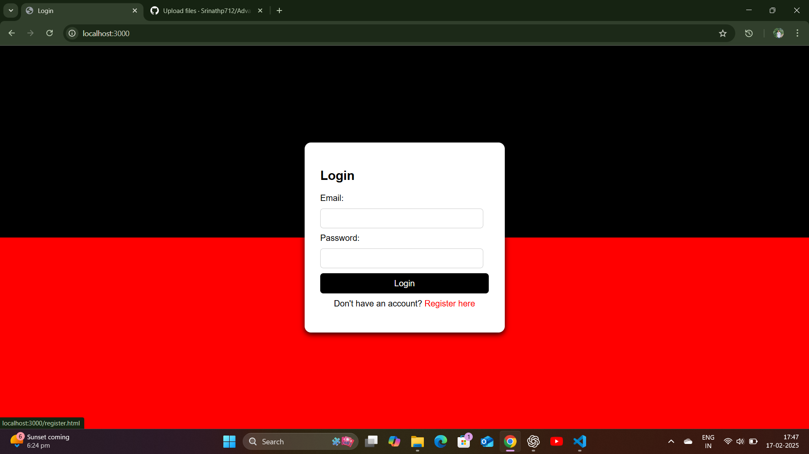
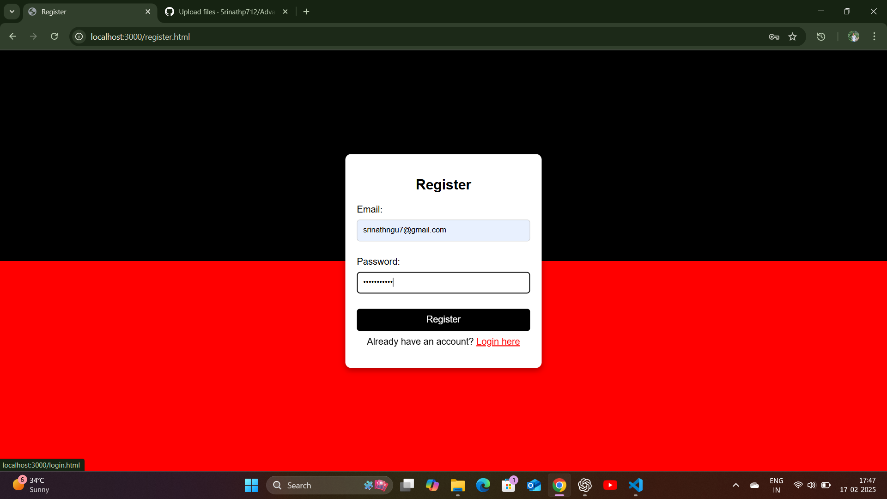
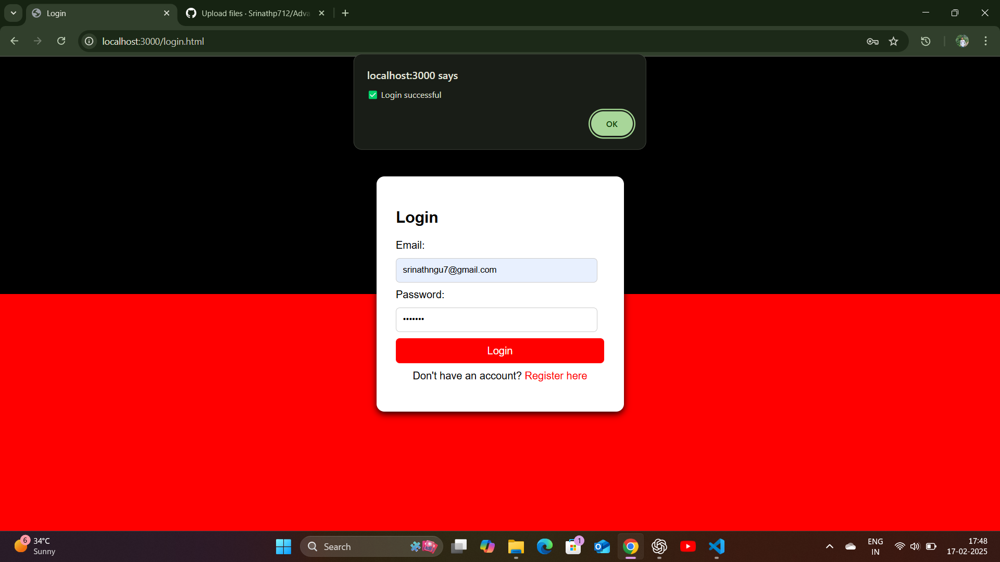

# Advanced_Meat_Delivery_Project
This project was inspired with my friend's business idea.

## CONTENTS
### Objective
### Problem Statement
### Overview
### Code
### Conclusion

## -> OBJECTIVE
### This application is used to deliver the fresh meat to the home as per customers request.

## -> PROBLEM STATEMENT
### Once me and my friend was sitting in a cafe. he said that, he want to start a meat delivery business to home address through online with low invesment. So i developed this project to help my friend to start his business to give overview of application, how excatly it works. this project is transperent, this localhost server can't give access to all users because it is not a public server. So i suggested him to buy servers with AWS Cloud and update the application with the payment gateways. 

## -> OVERVIEW
### 1.First we need to run the server using NodeJs

  

#### ->Then we can access the Application using localhost sever i.e (http://localhost:3000/)
#### ->It directs to the login page.

### 2. What happens in the Login Page..?

  
  
  

#### ->Here i used real time application athentication, means if user is first time using this application he needs to register.
#### ->If user perform login without having account, he/she experience the user not found message. 
#### ->All user data will be stored in Mysql database, which automatically connects when i run the server.
####

### 3.After Login..?
#### ->After login, user can see the dashboard, which contains meat products like Chicken, Mutton and Fish.
#### ->While displaying the dashboard, i made some animations like, images will slide to its position and welcome message is droped from top for good apperance.
#### ->In the dashboard, user selects meat and clicks add to cart buttton under the image what he/she wants.

### 4. What happens after clicking add to cart..?
#### ->User will see the meat products that he added to the cart with product name, price and quantity.
#### ->If he/she wants preferred quantity, EX:1kg,1.5kg,2kg,3kg... automatically price will be updated with preferred quantity.
#### ->TotalPrice will be displayed at the bottom. And their is a user details section, where he/she needs to enter the details like, Name, Phone.no, Address.
#### ->User clicks place order button to place the order.

## 5. What happens after placing the order..?
#### ->User will see the successfully order placed message.
#### ->In the backend after clicking place order button, These user details and total price are stored in my Mysql database to deliver the meat to home address. And for also doing analysis for the business using SQL queries.
#### ->

